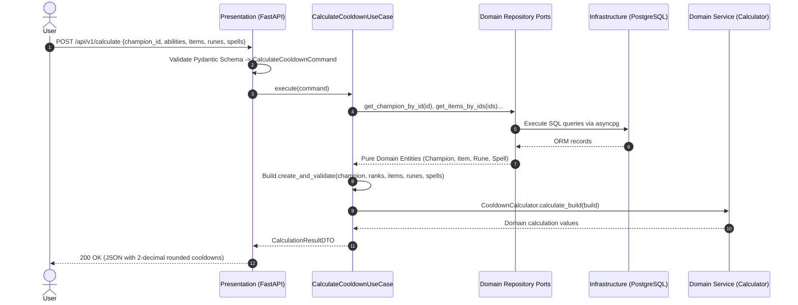
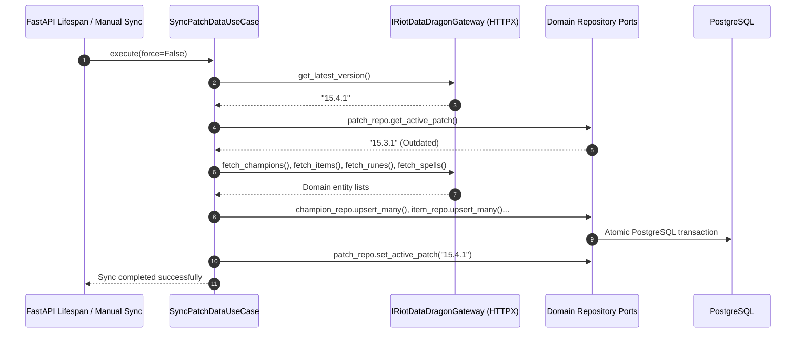

<!-- File path: docs/plans/designs/001_lol_cooldown_calculator-design.md -->

# Technical Blueprint — League of Legends Cooldown Calculator Core (Phase 1)
## Architecture Style: Domain-Driven Design (DDD) & Clean Architecture (Hexagonal / Ports & Adapters)

---

## 0. Project Memory Used

### Memory Confidence
**High** (Synchronized with `.agents/memory/`)

### Memory Documents Consulted
- `project-summary.md` — Project definition, core constraints, tech stack.
- `architecture/overview.md` — Decoupled client-server architecture, layer boundaries.
- `lessons/architectural-decisions.md` — ADR-001 (Current patch only), ADR-002 (Authoritative backend calculation engine), ADR-003 (Strict separation of haste domains).
- `lessons/known-problems.md` — Data Dragon rune HTML parsing limitations, item haste stat mapping, multi-charge edge case decisions.
- `indexes/file-map.json` — Initial workspace file index.

### RAG Queries Executed
- Query 1: `"LoL cooldown calculator DDD Clean Architecture layers domain entities value objects use cases"` → Established 4-layer Clean Architecture (Domain, Application, Infrastructure, Presentation) with dependency inversion.
- Query 2: `"FastAPI asyncpg SQLAlchemy 2.0 repository ports adapters unit of work"` → Defined clear separation between Domain Entities and SQLAlchemy ORM models using Repository Ports.

### Source Files Inspected (targeted)
- `docs/plans/001_lol_cooldown_calculator.md` — Approved implementation plan.
- `docs/league_of_legends_cooldown_calculator_prompt_v2.md` — Core feature specification and functional boundaries.

### Key Reusability Findings
- Domain entities and calculation services are completely decoupled from ORM and web frameworks, making them 100% portable and unit-testable with zero mocking.
- Riot Data Dragon CDN image paths are constructed dynamically on the frontend via pure value objects/DTOs to avoid storing binary media in PostgreSQL.

### Architectural Conflicts with Plan
- **Prior Draft Limitation**: Previous structure used a semi-flat service-repository pattern where database models and calculation services were intermingled.
- **Resolution**: Refactored entirely to **Strict DDD & Clean Architecture**:
  1. **Domain Layer**: Contains Entities, Aggregates (`Build`), Value Objects (`Cooldown`, `SkillRank`), Domain Services, and Repository Ports (Interfaces). Zero external framework dependencies.
  2. **Application Layer**: Contains Use Cases (`CalculateCooldownUseCase`, `SyncPatchDataUseCase`), Input/Output DTOs, and Gateway Ports.
  3. **Infrastructure Layer**: Implements Repository Ports using SQLAlchemy 2.0 ORM + asyncpg, implements Riot Gateway using HTTPX, and loads curated static overlays.
  4. **Presentation Layer**: FastAPI controllers, Pydantic v2 schemas, and HTTP error handlers.

---

## 1. Overview
- **Purpose**: Establish a robust, decoupled, and enterprise-grade software architecture applying Domain-Driven Design (DDD) and Clean Architecture principles to calculate League of Legends cooldowns for the active patch.
- **Scope**:
  - Pure Python Domain Core (Entities, Aggregates, Value Objects, Domain Services, Repository Ports).
  - Application Layer orchestrating Use Cases (`CalculateCooldownUseCase`, `SyncPatchDataUseCase`).
  - Infrastructure Layer handling async PostgreSQL persistence (local host), Data Dragon HTTP ingestion, and configuration.
  - Presentation Layer exposing RESTful APIs (`/api/v1/...`) via FastAPI.
  - Client Layer built with Vue 3, Vite, TailwindCSS, and Pinia.
- **Goals**:
  - Complete isolation of core domain logic from frameworks, ORMs, and external APIs.
  - Sub-50ms calculation API response time for local execution.
  - 100% unit test coverage on Domain and Application layers without database dependencies.
  - Strict compliance with file size limits (Python files <= 200 lines, Vue/JS files <= 500 lines).
- **Non-goals**:
  - Combat simulation, mana/energy simulation, damage numbers, auto-attack timers.
  - Historical patch comparison or multi-patch retention.
  - User authentication and cloud profile persistence.

---

## 2. Architecture Review
- **Feature Scope**: Exactly matches Prompt v2: Champion selection, independent skill rank steppers (Q/W/E/R), item inventory (max 6), haste-related runes with stack controls (e.g. Ultimate Hunter), summoner spells (2 slots), and authoritative backend calculation.
- **Frontend Design System**: Adheres to [001_frontend_design_system.md](file:///c:/Users/LAPTOP/OneDrive/Tài%20liệu/GitHub/cdr_calculate_lol/docs/plans/designs/001_frontend_design_system.md) following the **Minimalist Grunge & Gaming Compact Cockpit** aesthetic (3-column zero-scroll layout, matte charcoal flat surface, high-contrast monospace telemetry).
- **Clean Architecture Compliance**:
  - **The Dependency Rule**: Source code dependencies point strictly inwards: `Presentation -> Application -> Domain <- Infrastructure`.
  - **Domain Independence**: The `domain` package has zero imports from `fastapi`, `sqlalchemy`, `pydantic`, or `httpx`.
- **Testing & Build Impact**: Tests can execute instantaneously using in-memory mock repositories and mock gateways.
- **Deployment Impact**: Requires native local PostgreSQL (`localhost:5432`), Python 3.11+, and Node 18+.

---

## 3. Architecture Feasibility Analysis
- **Complexity**: Low-to-Medium. Clear boundaries prevent spaghetti code. Each file has a single responsibility.
- **Scalability**: High. Calculation is a pure CPU-bound mathematical operation executed in microseconds.
- **Maintainability**: Highest rating. Changes to Riot's JSON schema only affect Infrastructure Adapters; changes to API formats only affect Presentation Schemas; core cooldown calculation logic remains untouched.
- **Testability**: Maximum rating. Unit tests for Domain and Application layers run in milliseconds without network or database dependencies.

---

## 4. Alternative Design Analysis

### Alternative A: Traditional Flat Service-Repository Pattern
- **Description**: Route handlers call Service classes which directly query SQLAlchemy ORM models.
- **Advantages**: Fewer files initially; faster to scaffold for a trivial CRUD app.
- **Disadvantages**:
  - High coupling: Domain logic becomes tightly coupled with SQLAlchemy ORM session lifecycle and database types.
  - Difficult to test: Unit tests require database mocking or test databases.
  - High risk of business logic leaking into route handlers.
- **Complexity**: Low | **Maintainability**: Low-to-Medium | **Technical Debt**: High.

### Alternative B: Strict DDD + Clean Architecture (Ports & Adapters) (Chosen)
- **Description**: 4 concentric layers with explicit Domain Entities, Value Objects, Use Cases, Repository Ports, and Infrastructure Adapters.
- **Advantages**:
  - Business rules (`Build` aggregate, `Cooldown` value object, calculation engine) are 100% pure and independent.
  - Swapping data sources (e.g. adding CommunityDragon or switching database engines) requires zero changes to domain or application layers.
  - Fully compliant with Clean Architecture and SOLID principles.
- **Disadvantages**: More files due to strict separation of ORM models from Domain entities.
- **Complexity**: Medium | **Maintainability**: Very High | **Effort**: 3-4 days.

---

## 5. Architecture Recommendation
**Recommendation: Alternative B (Strict DDD + Clean Architecture)**
- **Technical Justification**: Clean Architecture protects the core business logic (cooldown formulas, haste typing, build invariants) from external churn (Riot API updates, framework upgrades, ORM shifts). It enforces modularity and ensures every Python file remains under the 200-line ceiling.

---

## 6. Architecture Decision Records (ADRs)

### ADR-001: Build as the Domain Aggregate Root
- **Context**: A user configuration consists of a Champion, 4 ability ranks, up to 6 items, selected runes with stack counts, and 2 summoner spells.
- **Decision**: Model `Build` as a Domain Aggregate Root in `domain/entities/build.py`. The Aggregate Root enforces invariants:
  - Skill ranks must not exceed ability maximum ranks.
  - Maximum 6 items allowed; duplicates restricted where applicable.
  - Maximum 2 summoner spells allowed.
- **Reason**: Centralizes domain validation in the domain model rather than scattering checks across HTTP controllers.

### ADR-002: Separation of Domain Entities from SQLAlchemy ORM Models
- **Context**: ORM models have table metadata, foreign keys, and lazy-loading semantics that pollute pure domain logic.
- **Decision**: Domain entities (`Champion`, `Ability`, `Item`, `Rune`, `SummonerSpell`) are pure Python dataclasses. SQLAlchemy ORM models live strictly in `infrastructure/database/models/`. Repository adapters translate between ORM models and Domain entities.
- **Reason**: Adheres to the Dependency Inversion Principle; persistence concerns never infect business logic.

### ADR-003: Repository Ports in Domain Layer, Adapters in Infrastructure
- **Context**: Use cases need to retrieve champions, items, and runes without knowing how they are stored.
- **Decision**: Define abstract repository interfaces (`IChampionRepository`, `IItemRepository`, etc.) in `domain/repositories/`. Implement them in `infrastructure/repositories/` using SQLAlchemy 2.0 async sessions.
- **Reason**: Follows Hexagonal / Ports & Adapters pattern; use cases depend on abstractions, not implementations.

### ADR-004: Riot Data Dragon as an External Gateway Port
- **Context**: Patch synchronization requires querying external Riot CDN endpoints.
- **Decision**: Define `IRiotDataDragonGateway` interface in `application/ports/riot_gateway.py`. Implement `RiotDataDragonClient` using `httpx` in `infrastructure/external/riot_client.py`.
- **Reason**: Decouples network I/O from synchronization use cases, enabling reliable testing via mock gateways.

---

## 7. Open Questions
- **No open questions identified.** All domain rules, formulas, exception policies, and local runtime constraints are formally established.

---

## 8. Architecture Risk Analysis

| Risk | Cause | Impact | Probability | Mitigation | Monitoring | Recovery |
|------|-------|--------|-------------|------------|------------|----------|
| **Data Dragon Schema Key Drift** | Riot changes nested JSON keys in a new season patch | Sync adapter fails to parse champions/items | Medium | Isolate parsing inside `infrastructure/external/riot_client.py`; validate against schema before converting to domain entities | Log parsing warnings during sync | Keep previous patch data active in DB until new patch validation succeeds |
| **Local PostgreSQL Connection Timeout** | PostgreSQL service stopped or invalid credentials in `.env` | Backend cannot start or query data | Medium | Graceful startup probe with informative console logging | Health check endpoint `/api/v1/health` | Output actionable connection error message in terminal |
| **Float Precision Presentation Drift** | Binary floating-point arithmetic creating long decimals | Inconsistent UI presentation | Low | Store raw float in Domain Value Objects; apply standard rounding `round(val, 2)` at presentation DTO mapping | Automated assertions in Domain Unit Tests | Explicit rounding in Presentation Schema serializers |

---

## 9. Future Extension Points
1. **Build Sharing / Persistence**: Add `IBuildRepository` port in Domain and SQL adapter in Infrastructure; implement `SaveBuildUseCase` to return shareable build tokens.
2. **Containerization / Docker**: Add `Dockerfile` and `docker-compose.yml` to package existing layers without altering any application code.
3. **Multi-Patch Comparison**: Extend `IPatchRepository` and domain entities to accept `PatchVersion` query parameters.

---

## 10. Project Structure (DDD & Clean Architecture)

```text
cdr_calculate_lol/
├── backend/
│   ├── alembic/
│   │   ├── versions/
│   │   └── env.py
│   ├── app/
│   │   ├── domain/                               # LAYER 1: PURE DOMAIN (Zero external deps)
│   │   │   ├── __init__.py
│   │   │   ├── enums.py                          # SkillSlot, HasteType, SpellSlot
│   │   │   ├── value_objects.py                  # Cooldown, AbilityHaste, SkillRank, PatchVersion
│   │   │   ├── entities/                         # Domain Entities & Aggregates
│   │   │   │   ├── __init__.py
│   │   │   │   ├── ability.py                    # Ability entity & rank cooldown logic
│   │   │   │   ├── champion.py                   # Champion aggregate
│   │   │   │   ├── item.py                       # Item entity
│   │   │   │   ├── rune.py                       # Rune entity with stack mechanics
│   │   │   │   ├── spell.py                      # SummonerSpell entity
│   │   │   │   └── build.py                      # Build Aggregate Root (validates invariants)
│   │   │   ├── services/                         # Domain Services
│   │   │   │   ├── __init__.py
│   │   │   │   └── cooldown_calculator.py        # Pure algebraic cooldown calculator
│   │   │   ├── repositories/                     # Domain Repository Interfaces (Ports)
│   │   │   │   ├── __init__.py
│   │   │   │   ├── champion_repository.py        # IChampionRepository
│   │   │   │   ├── item_repository.py            # IItemRepository
│   │   │   │   ├── rune_repository.py            # IRuneRepository
│   │   │   │   ├── spell_repository.py           # ISpellRepository
│   │   │   │   └── patch_repository.py           # IPatchRepository
│   │   │   └── exceptions.py                     # Domain Exceptions (DomainError, InvalidRankError)
│   │   │
│   │   ├── application/                          # LAYER 2: APPLICATION (Use Cases & DTOs)
│   │   │   ├── __init__.py
│   │   │   ├── dtos/                             # Input/Output DTOs
│   │   │   │   ├── __init__.py
│   │   │   │   ├── calculate_dto.py              # CalculateCooldownCommand, CalculationResultDTO
│   │   │   │   ├── champion_dto.py               # ChampionDTO, AbilityDTO
│   │   │   │   ├── item_dto.py                   # ItemDTO
│   │   │   │   ├── rune_dto.py                   # RuneDTO
│   │   │   │   └── spell_dto.py                  # SpellDTO
│   │   │   ├── ports/                            # Gateway Ports (Outbound Interfaces)
│   │   │   │   ├── __init__.py
│   │   │   │   └── riot_gateway.py               # IRiotDataDragonGateway
│   │   │   └── use_cases/                        # Use Case Interactors
│   │   │       ├── __init__.py
│   │   │       ├── calculate_cooldown.py         # CalculateCooldownUseCase
│   │   │       ├── sync_patch_data.py            # SyncPatchDataUseCase
│   │   │       ├── get_champions.py              # GetChampionsUseCase, GetChampionByIdUseCase
│   │   │       ├── get_items.py                  # GetItemsUseCase
│   │   │       ├── get_runes.py                  # GetRunesUseCase
│   │   │       └── get_spells.py                 # GetSpellsUseCase
│   │   │
│   │   ├── infrastructure/                       # LAYER 3: INFRASTRUCTURE (Adapters)
│   │   │   ├── __init__.py
│   │   │   ├── config/                           # Configuration via pydantic-settings
│   │   │   │   ├── __init__.py
│   │   │   │   └── settings.py
│   │   │   ├── database/                         # Database connection & ORM
│   │   │   │   ├── __init__.py
│   │   │   │   ├── session.py                    # Async engine & session factory
│   │   │   │   └── models/                       # SQLAlchemy ORM Models
│   │   │   │       ├── __init__.py
│   │   │   │       ├── base.py
│   │   │   │       ├── champion_orm.py
│   │   │   │       ├── ability_orm.py
│   │   │   │       ├── item_orm.py
│   │   │   │       ├── rune_orm.py
│   │   │   │       ├── spell_orm.py
│   │   │   │       └── patch_orm.py
│   │   │   ├── repositories/                     # Repository Implementations (Adapters)
│   │   │   │   ├── __init__.py
│   │   │   │   ├── sql_champion_repo.py          # Implements IChampionRepository
│   │   │   │   ├── sql_item_repo.py              # Implements IItemRepository
│   │   │   │   ├── sql_rune_repo.py              # Implements IRuneRepository
│   │   │   │   ├── sql_spell_repo.py             # Implements ISpellRepository
│   │   │   │   └── sql_patch_repo.py             # Implements IPatchRepository
│   │   │   ├── external/                         # External Gateways & Curated Overlays
│   │   │   │   ├── __init__.py
│   │   │   │   ├── riot_client.py                # Implements IRiotDataDragonGateway via httpx
│   │   │   │   └── rune_modifiers.json           # Curated static haste rules for stacking runes
│   │   │   └── di/                               # Dependency Injection Wiring
│   │   │       ├── __init__.py
│   │   │       └── container.py                  # FastAPI Depends providers
│   │   │
│   │   ├── presentation/                         # LAYER 4: PRESENTATION (Web API)
│   │   │   ├── __init__.py
│   │   │   ├── api/
│   │   │   │   ├── __init__.py
│   │   │   │   └── v1/
│   │   │   │       ├── __init__.py
│   │   │   │       ├── router.py
│   │   │   │       ├── calculate.py              # POST /api/v1/calculate
│   │   │   │       ├── champions.py              # GET /api/v1/champions
│   │   │   │       ├── items.py                  # GET /api/v1/items
│   │   │   │       ├── runes.py                  # GET /api/v1/runes
│   │   │   │       ├── spells.py                 # GET /api/v1/summoner-spells
│   │   │   │       └── sync.py                   # POST /api/v1/sync
│   │   │   ├── schemas/                          # Pydantic Request/Response View Models
│   │   │   │   ├── __init__.py
│   │   │   │   ├── calculate_schema.py
│   │   │   │   ├── champion_schema.py
│   │   │   │   ├── item_schema.py
│   │   │   │   ├── rune_schema.py
│   │   │   │   └── spell_schema.py
│   │   │   └── middlewares/                      # Exception Handling & CORS
│   │   │       ├── __init__.py
│   │   │       └── error_handler.py
│   │   │
│   │   └── main.py                               # Application entrypoint
│   ├── tests/
│   │   ├── unit/
│   │   │   ├── domain/
│   │   │   │   ├── test_cooldown_calculator.py
│   │   │   │   └── test_build_aggregate.py
│   │   │   └── application/
│   │   │       └── test_calculate_use_case.py
│   │   └── integration/
│   │       ├── test_api_calculate.py
│   │       └── test_sql_repositories.py
│   ├── alembic.ini
│   ├── requirements.txt
│   └── .env.example
├── frontend/
│   ├── src/
│   │   ├── assets/
│   │   │   └── main.css
│   │   ├── components/
│   │   │   ├── ChampionSelector.vue
│   │   │   ├── AbilityPanel.vue
│   │   │   ├── ItemInventory.vue
│   │   │   ├── RuneSection.vue
│   │   │   ├── SummonerSpellSelector.vue
│   │   │   └── CooldownSummary.vue
│   │   ├── services/
│   │   │   └── api.js
│   │   ├── stores/
│   │   │   └── calculatorStore.js
│   │   ├── App.vue
│   │   └── main.js
│   ├── index.html
│   ├── package.json
│   ├── tailwind.config.js
│   └── vite.config.js
└── docs/
```

### Layer Interaction & Dependency Direction:
1. `presentation` imports `application` (Use Cases, DTOs) and `infrastructure.di`.
2. `infrastructure` imports `domain` (Repository interfaces, Entities) and `application` (Gateway ports).
3. `application` imports `domain` (Entities, Aggregates, Value Objects, Domain Services, Repository interfaces).
4. `domain` imports **NOTHING** from application, infrastructure, or presentation.

---

## 11. Dependencies

### Python Packages (`backend/requirements.txt`)
```text
fastapi>=0.110.0,<1.0.0
uvicorn[standard]>=0.28.0,<1.0.0
pydantic>=2.6.0,<3.0.0
pydantic-settings>=2.2.0,<3.0.0
sqlalchemy>=2.0.28,<3.0.0
asyncpg>=0.29.0,<1.0.0
alembic>=1.13.1,<2.0.0
httpx>=0.27.0,<1.0.0
pytest>=8.1.0,<9.0.0
pytest-asyncio>=0.23.5,<1.0.0
```

### npm Packages (`frontend/package.json`)
```json
{
  "dependencies": {
    "vue": "^3.4.21",
    "pinia": "^2.1.7",
    "axios": "^1.6.8",
    "lucide-vue-next": "^0.359.0"
  },
  "devDependencies": {
    "@vitejs/plugin-vue": "^5.0.4",
    "vite": "^5.1.6",
    "tailwindcss": "^3.4.1",
    "postcss": "^8.4.35",
    "autoprefixer": "^10.4.18"
  }
}
```

---

## 12. File Breakdown

| File Path | Type | Layer | Max Lines | Responsibility |
|-----------|------|-------|-----------|----------------|
| `backend/app/domain/enums.py` | [NEW] | Domain | 40 | Defines `SkillSlot`, `HasteType`, `SpellSlot` |
| `backend/app/domain/value_objects.py` | [NEW] | Domain | 80 | Immutable Value Objects: `Cooldown`, `AbilityHaste`, `SkillRank`, `PatchVersion` |
| `backend/app/domain/entities/ability.py` | [NEW] | Domain | 60 | Domain entity for Ability with rank boundaries and cooldown list |
| `backend/app/domain/entities/champion.py` | [NEW] | Domain | 70 | Domain entity for Champion containing Q/W/E/R abilities |
| `backend/app/domain/entities/item.py` | [NEW] | Domain | 50 | Domain entity for Item with ability haste value |
| `backend/app/domain/entities/rune.py` | [NEW] | Domain | 70 | Domain entity for Rune with stack calculations (base + stack * rate) |
| `backend/app/domain/entities/spell.py` | [NEW] | Domain | 50 | Domain entity for Summoner Spell with base cooldown |
| `backend/app/domain/entities/build.py` | [NEW] | Domain | 110 | **Aggregate Root**: Enforces build invariants (rank boundaries, max 6 items, max 2 spells) |
| `backend/app/domain/services/cooldown_calculator.py` | [NEW] | Domain | 90 | **Domain Service**: Pure mathematical cooldown calculation per haste domain |
| `backend/app/domain/repositories/champion_repository.py` | [NEW] | Domain | 50 | Port interface `IChampionRepository` |
| `backend/app/domain/repositories/item_repository.py` | [NEW] | Domain | 40 | Port interface `IItemRepository` |
| `backend/app/domain/repositories/rune_repository.py` | [NEW] | Domain | 40 | Port interface `IRuneRepository` |
| `backend/app/domain/repositories/spell_repository.py` | [NEW] | Domain | 40 | Port interface `ISpellRepository` |
| `backend/app/domain/repositories/patch_repository.py` | [NEW] | Domain | 40 | Port interface `IPatchRepository` |
| `backend/app/domain/exceptions.py` | [NEW] | Domain | 50 | Domain exceptions (`DomainError`, `InvalidRankError`, `ItemLimitError`) |
| `backend/app/application/dtos/calculate_dto.py` | [NEW] | Application | 70 | Command DTO `CalculateCooldownCommand` & Output DTO `CalculationResultDTO` |
| `backend/app/application/ports/riot_gateway.py` | [NEW] | Application | 50 | Port interface `IRiotDataDragonGateway` |
| `backend/app/application/use_cases/calculate_cooldown.py` | [NEW] | Application | 100 | **Use Case**: Loads entities, builds Aggregate, invokes Domain Service, returns DTO |
| `backend/app/application/use_cases/sync_patch_data.py` | [NEW] | Application | 130 | **Use Case**: Coordinates patch check, downloads data, converts to Domain entities, saves |
| `backend/app/application/use_cases/get_champions.py` | [NEW] | Application | 70 | **Use Case**: Query champions list & detail via repository port |
| `backend/app/application/use_cases/get_items.py` | [NEW] | Application | 60 | **Use Case**: Query items with search filter via repository port |
| `backend/app/application/use_cases/get_runes.py` | [NEW] | Application | 50 | **Use Case**: Query haste-relevant runes via repository port |
| `backend/app/application/use_cases/get_spells.py` | [NEW] | Application | 50 | **Use Case**: Query summoner spells via repository port |
| `backend/app/infrastructure/config/settings.py` | [NEW] | Infrastructure | 50 | Environment configuration via Pydantic Settings |
| `backend/app/infrastructure/database/session.py` | [NEW] | Infrastructure | 60 | Async SQLAlchemy engine & session factory |
| `backend/app/infrastructure/database/models/*.py` | [NEW] | Infrastructure | 60 each | SQLAlchemy ORM table declarations |
| `backend/app/infrastructure/repositories/*.py` | [NEW] | Infrastructure | 90 each | SQLAlchemy adapters implementing Domain Repository Ports |
| `backend/app/infrastructure/external/riot_client.py` | [NEW] | Infrastructure | 160 | HTTPX adapter implementing `IRiotDataDragonGateway` |
| `backend/app/infrastructure/di/container.py` | [NEW] | Infrastructure | 90 | Dependency injection providers wiring Repositories & Use Cases to FastAPI |
| `backend/app/presentation/api/v1/*.py` | [NEW] | Presentation | 60 each | HTTP controller endpoints consuming Use Cases |
| `backend/app/presentation/schemas/*.py` | [NEW] | Presentation | 60 each | Pydantic v2 schemas for HTTP validation |
| `backend/app/presentation/middlewares/error_handler.py` | [NEW] | Presentation | 60 | Maps Domain & Application exceptions to HTTP 400/404/422 responses |
| `backend/app/main.py` | [NEW] | Presentation | 70 | FastAPI app bootstrap & router registration |
| `frontend/src/stores/calculatorStore.js` | [NEW] | Client | 220 | Pinia store managing build state and debounced API requests |
| `frontend/src/components/*.vue` | [NEW] | Client | 150-250 | Vue 3 UI components |

---

## 13. Interface Design (Ports & Use Cases)

### Domain Repository Ports (`backend/app/domain/repositories/`)

```python
from abc import ABC, abstractmethod
from app.domain.entities.champion import Champion
from app.domain.entities.item import Item
from app.domain.entities.rune import Rune
from app.domain.entities.spell import SummonerSpell

class IChampionRepository(ABC):
    @abstractmethod
    async def get_all(self) -> list[Champion]: ...
    @abstractmethod
    async def get_by_id(self, champion_id: str) -> Champion | None: ...
    @abstractmethod
    async def upsert_many(self, champions: list[Champion]) -> None: ...

class IItemRepository(ABC):
    @abstractmethod
    async def get_all(self, search: str | None = None) -> list[Item]: ...
    @abstractmethod
    async def get_by_ids(self, item_ids: list[int]) -> list[Item]: ...
    @abstractmethod
    async def upsert_many(self, items: list[Item]) -> None: ...

class IRuneRepository(ABC):
    @abstractmethod
    async def get_haste_runes(self) -> list[Rune]: ...
    @abstractmethod
    async def get_by_ids(self, rune_ids: list[int]) -> list[Rune]: ...
    @abstractmethod
    async def upsert_many(self, runes: list[Rune]) -> None: ...

class ISpellRepository(ABC):
    @abstractmethod
    async def get_all(self) -> list[SummonerSpell]: ...
    @abstractmethod
    async def get_by_ids(self, spell_ids: list[str]) -> list[SummonerSpell]: ...
    @abstractmethod
    async def upsert_many(self, spells: list[SummonerSpell]) -> None: ...

class IPatchRepository(ABC):
    @abstractmethod
    async def get_active_patch(self) -> str | None: ...
    @abstractmethod
    async def set_active_patch(self, patch_version: str) -> None: ...
```

### Application Gateway Port (`backend/app/application/ports/riot_gateway.py`)

```python
from abc import ABC, abstractmethod
from app.domain.entities.champion import Champion
from app.domain.entities.item import Item
from app.domain.entities.rune import Rune
from app.domain.entities.spell import SummonerSpell

class IRiotDataDragonGateway(ABC):
    @abstractmethod
    async def get_latest_version(self) -> str: ...
    @abstractmethod
    async def fetch_champions(self, version: str) -> list[Champion]: ...
    @abstractmethod
    async def fetch_items(self, version: str) -> list[Item]: ...
    @abstractmethod
    async def fetch_runes(self, version: str) -> list[Rune]: ...
    @abstractmethod
    async def fetch_spells(self, version: str) -> list[SummonerSpell]: ...
```

---

## 14. DTOs, Entities & Value Objects

### 1. Value Objects (`backend/app/domain/value_objects.py`)
```python
from dataclasses import dataclass
from app.domain.exceptions import InvalidRankError, InvalidHasteError

@dataclass(frozen=True)
class Cooldown:
    seconds: float
    def __post_init__(self) -> None:
        if self.seconds < 0:
            raise InvalidHasteError("Cooldown cannot be negative.")

@dataclass(frozen=True)
class AbilityHaste:
    value: float
    def __post_init__(self) -> None:
        if self.value < 0:
            raise InvalidHasteError("Haste cannot be negative.")

@dataclass(frozen=True)
class SkillRank:
    rank: int
    max_rank: int
    def __post_init__(self) -> None:
        if not (1 <= self.rank <= self.max_rank):
            raise InvalidRankError(f"Rank {self.rank} is outside [1, {self.max_rank}].")
```

### 2. Domain Aggregate Root (`backend/app/domain/entities/build.py`)
```python
from dataclasses import dataclass
from app.domain.entities.champion import Champion
from app.domain.entities.item import Item
from app.domain.entities.rune import RuneSelection
from app.domain.entities.spell import SummonerSpell
from app.domain.value_objects import SkillRank
from app.domain.exceptions import ItemLimitError, SpellLimitError

@dataclass
class Build:
    champion: Champion
    skill_ranks: dict[str, SkillRank]
    items: list[Item]
    runes: list[RuneSelection]
    spells: list[SummonerSpell]

    def validate_invariants(self) -> None:
        if len(self.items) > 6:
            raise ItemLimitError("A build cannot exceed 6 items.")
        if len(self.spells) > 2:
            raise SpellLimitError("A build cannot exceed 2 summoner spells.")
```

### 3. Application Command & Result DTOs (`backend/app/application/dtos/calculate_dto.py`)
```python
from dataclasses import dataclass

@dataclass(frozen=True)
class RuneSelectionInputDTO:
    rune_id: int
    stacks: int

@dataclass(frozen=True)
class CalculateCooldownCommand:
    champion_id: str
    abilities: dict[str, int]
    items: list[int]
    runes: list[RuneSelectionInputDTO]
    summoner_spells: list[str]

@dataclass(frozen=True)
class AbilityCooldownResultDTO:
    slot: str
    rank: int
    base_cooldown: float
    applicable_haste: float
    final_cooldown: float

@dataclass(frozen=True)
class CalculationResultDTO:
    champion_id: str
    ability_haste: float
    ultimate_haste: float
    abilities: dict[str, AbilityCooldownResultDTO]
    summoner_spells: list[dict[str, float | str]]
```

---

## 15. Class & Function Signatures

### Domain Service: `CooldownCalculator` (`backend/app/domain/services/cooldown_calculator.py`)
```python
class CooldownCalculator:
    @staticmethod
    def calculate_cooldown(base: Cooldown, haste: AbilityHaste) -> Cooldown:
        """Formula: Final = Base * 100 / (100 + Haste)"""
        final_secs = base.seconds * 100.0 / (100.0 + haste.value)
        return Cooldown(final_secs)

    @classmethod
    def calculate_build(cls, build: Build) -> dict[str, Any]:
        """Calculates cooldowns for all Q/W/E/R and summoner spells according to haste rules."""
        ...
```

### Application Use Case: `CalculateCooldownUseCase` (`backend/app/application/use_cases/calculate_cooldown.py`)
```python
class CalculateCooldownUseCase:
    def __init__(
        self,
        champion_repo: IChampionRepository,
        item_repo: IItemRepository,
        rune_repo: IRuneRepository,
        spell_repo: ISpellRepository
    ) -> None: ...

    async def execute(self, command: CalculateCooldownCommand) -> CalculationResultDTO:
        """Executes the calculation use case orchestrating domain repositories and services."""
        ...
```

### Application Use Case: `SyncPatchDataUseCase` (`backend/app/application/use_cases/sync_patch_data.py`)
```python
class SyncPatchDataUseCase:
    def __init__(
        self,
        gateway: IRiotDataDragonGateway,
        patch_repo: IPatchRepository,
        champion_repo: IChampionRepository,
        item_repo: IItemRepository,
        rune_repo: IRuneRepository,
        spell_repo: ISpellRepository
    ) -> None: ...

    async def execute(self, force: bool = False) -> dict[str, Any]:
        """Syncs the latest Riot Data Dragon patch data into PostgreSQL."""
        ...
```

---

## 16. Data Flow in Clean Architecture

```text
[HTTP POST /api/v1/calculate JSON]
                 │
                 ▼
[Presentation: calculate.py Controller]
                 │ (Parses Pydantic schema into CalculateCooldownCommand DTO)
                 ▼
[Application: CalculateCooldownUseCase]
        ┌────────┴────────┐
        │                 │ (Calls Repository Ports)
        ▼                 ▼
[IChampionRepository]  [IItemRepository, IRuneRepository, ISpellRepository]
        │                 │
        │ (Implemented by Infrastructure via Asyncpg SQLAlchemy)
        ▼                 ▼
[Returns Pure Domain Entities: Champion, Item, Rune, Spell]
                 │
                 ▼
[Application constructs 'Build' Aggregate Root]
                 │ (Enforces build invariants: rank limits, max 6 items)
                 ▼
[Domain Service: CooldownCalculator]
                 │ (Pure math: Final = Base * 100 / (100 + Haste))
                 ▼
[Application maps Domain results to CalculationResultDTO]
                 │
                 ▼
[Presentation: Serializes to Pydantic JSON with 2-decimal rounding]
                 │
                 ▼
[HTTP 200 OK Response]
```

---

## 17. Sequence Diagrams

### 1. Calculation Workflow (Clean Architecture)



### 2. Patch Synchronization Workflow



---

## 18. Error Handling Strategy

| Error Scenario | Origin Layer | Raised Exception | HTTP Code | Response Body |
|----------------|--------------|------------------|-----------|---------------|
| Skill rank > max rank | Domain (`Build`) | `InvalidRankError` | 400 | `{"error": "INVALID_RANK", "detail": "Rank 6 exceeds max rank 5"}` |
| > 6 items provided | Domain (`Build`) | `ItemLimitError` | 400 | `{"error": "ITEM_LIMIT", "detail": "Cannot exceed 6 items"}` |
| Champion ID not found | Application (Use Case) | `EntityNotFoundError` | 404 | `{"error": "NOT_FOUND", "detail": "Champion 'invalid_id' not found"}` |
| Malformed JSON types | Presentation | Pydantic `ValidationError` | 422 | Standard FastAPI validation details |
| Data Dragon unreachable | Infrastructure (Client) | `GatewayUnavailableError`| 503 | `{"error": "SYNC_FAILED", "detail": "Riot CDN unreachable"}` |

---

## 19. Concurrency & Async Model
- **FastAPI / ASGI**: Handled asynchronously via `uvicorn` using `async def` endpoints.
- **Async Database Connection**: Repositories use `AsyncSession` with an `asyncpg` connection pool (pool size: 10, max overflow: 20) in non-blocking mode.
- **Domain Concurrency**: All domain entities, value objects, and calculation services are pure, immutable, and stateless, ensuring 100% thread safety across concurrent requests.

---

## 20. Testing Blueprint

1. **Domain Unit Tests (`backend/tests/unit/domain/`)**:
   - `test_cooldown_calculator.py`: Tests pure formula `Base * 100 / (100 + Haste)` for Q/W/E vs R; tests Ultimate Hunter stack increments.
   - `test_build_aggregate.py`: Verifies aggregate invariants (rejection of rank 6 for a 5-rank ability; rejection of 7 items; rejection of 3 summoner spells).
2. **Application Unit Tests (`backend/tests/unit/application/`)**:
   - `test_calculate_use_case.py`: Uses in-memory mock repository ports to test `CalculateCooldownUseCase` without database dependencies.
3. **Infrastructure Integration Tests (`backend/tests/integration/`)**:
   - `test_sql_repositories.py`: Verifies async SQLAlchemy repository adapters against a local PostgreSQL test database.
   - `test_api_calculate.py`: End-to-end HTTP integration test via `httpx.AsyncClient`.

---

## 21. Implementation Complexity
- **Overall Complexity**: Medium (Architecture is rigorous and clean; code is modular and easy to read).
- **Development Risk**: Low (Zero ambiguity; strict DDD boundaries prevent regressions).
- **Estimated PR Count**: 6 PRs.

---

## 22. Implementation Order (Incremental PR Breakdown)

### PR 1: Project Scaffolding & Core Domain Layer
- **Objective**: Establish project layout and implement Layer 1 (Domain Core) with 100% unit test coverage.
- **Files**:
  - `backend/app/domain/`: `enums.py`, `value_objects.py`, `exceptions.py`
  - `backend/app/domain/entities/`: `ability.py`, `champion.py`, `item.py`, `rune.py`, `spell.py`, `build.py`
  - `backend/app/domain/services/`: `cooldown_calculator.py`
  - `backend/app/domain/repositories/`: Repository port interfaces
  - `backend/tests/unit/domain/`: Domain unit tests
- **DoD**: Pure domain runs with 0 external dependencies; all domain unit tests pass.

### PR 2: Infrastructure Layer — Database & Repositories
- **Objective**: Implement Layer 3 database models and repository adapters for local PostgreSQL.
- **Files**:
  - `backend/app/infrastructure/config/settings.py`, `database/session.py`
  - `backend/app/infrastructure/database/models/*.py`
  - `backend/app/infrastructure/repositories/*.py`
  - `backend/alembic/`
- **DoD**: Alembic creates tables in local PostgreSQL; repository adapters pass integration tests.

### PR 3: Infrastructure Layer — Riot Data Dragon Gateway & Sync Use Case
- **Objective**: Implement external HTTPX client and sync use case.
- **Files**:
  - `backend/app/infrastructure/external/rune_modifiers.json`, `riot_client.py`
  - `backend/app/application/ports/riot_gateway.py`
  - `backend/app/application/use_cases/sync_patch_data.py`
- **DoD**: Running sync use case populates local PostgreSQL with active patch data.

### PR 4: Application Layer Use Cases & Presentation Layer APIs
- **Objective**: Implement `CalculateCooldownUseCase`, query use cases, FastAPI routers, and Pydantic schemas.
- **Files**:
  - `backend/app/application/dtos/`, `use_cases/calculate_cooldown.py`, `get_champions.py`...
  - `backend/app/infrastructure/di/container.py`
  - `backend/app/presentation/api/v1/*.py`, `schemas/*.py`, `middlewares/error_handler.py`
  - `backend/app/main.py`
- **DoD**: `POST /api/v1/calculate` returns correct calculated cooldowns with sub-50ms latency.

### PR 5: Frontend Client Core & Components
- **Objective**: Build the Vue 3 + TailwindCSS interactive user interface.
- **Files**:
  - `frontend/src/services/api.js`, `frontend/src/stores/calculatorStore.js`
  - `frontend/src/components/`: `ChampionSelector.vue`, `AbilityPanel.vue`, `ItemInventory.vue`, `RuneSection.vue`, `SummonerSpellSelector.vue`, `CooldownSummary.vue`
  - `frontend/src/App.vue`
- **DoD**: Interactive UI allows champion search, skill rank adjustment, item/rune selection, and renders responsive cooldown results.

### PR 6: End-to-End Integration, Debouncing & Documentation
- **Objective**: Connect frontend with backend API, verify edge cases, add debouncing, and update documentation.
- **Files**:
  - `frontend/src/stores/calculatorStore.js` (150ms debounce)
  - `README.md`
- **DoD**: Full end-to-end verification passing in browser against known game cooldown values.

---

## 23. Executive Architecture Summary
- **Architecture Pattern**: Domain-Driven Design (DDD) with Clean Architecture (Hexagonal / Ports & Adapters).
- **Core Advantages**:
  1. **Domain Isolation**: Core calculation rules and `Build` invariants are completely decoupled from frameworks and database technologies.
  2. **Testability**: Domain and Application layers can be tested exhaustively without running PostgreSQL or making network requests.
  3. **File Size Compliance**: Every Python file is strictly under 200 lines by delegating distinct responsibilities to dedicated entities, value objects, ports, and use cases.
  4. **Adaptability**: Future enhancements (e.g. Docker containerization, cloud deployment, build sharing) can be added as new Infrastructure adapters without changing a single line of business logic.

---

## 24. Acceptance Checklist
- [x] Domain Layer has 0 framework/ORM dependencies
- [x] Clean Architecture layers strictly respect the Dependency Rule
- [x] Build Aggregate Root enforces domain invariants
- [x] Repository interfaces (Ports) defined in Domain Layer
- [x] Repository implementations (Adapters) defined in Infrastructure Layer
- [x] Data Dragon client isolated behind Gateway Port
- [x] File size limits respected (Python <= 200 lines, Vue <= 500 lines)
- [x] Pure mathematical domain service for cooldown calculations
- [x] Error handling maps domain exceptions to clean HTTP responses
- [x] Testing blueprint covers Unit, Integration, and Contract testing
- [x] 6-PR incremental implementation sequence defined
- [x] Native local PostgreSQL deployment supported without Docker
