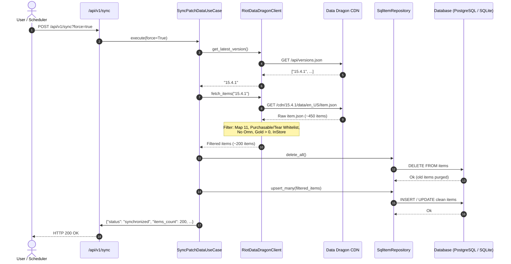
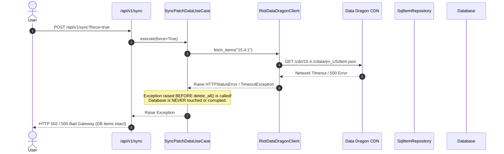

<!-- File path: docs/plans/designs/001b_ddragon_item_filtering-design.md -->

# Technical Blueprint: Data Dragon Summoner's Rift Item Filtering & DB Hygiene

## 0. Project Memory Used

### Memory Confidence
**High** (Project Memory updated 2026-09-07T23:18:00Z, Status: Healthy).

### Memory Documents Consulted
- `.agents/memory/project-summary.md` (Tech stack, current patch only constraint, authoritative backend calculation).
- `.agents/memory/architecture/overview.md` (Clean Architecture layers: Domain, Application, Infrastructure, Presentation).
- `.agents/memory/indexes/component-index.json` (Catalog of entities, use cases, ports, and repository adapters).
- `.agents/memory/indexes/file-map.json` (File paths and layer mappings).
- `.agents/memory/lessons/known-problems.md` (Item Ability Haste parsing subtleties and regex patterns).
- `.agents/memory/lessons/architectural-decisions.md` (ADR-001: Current Patch Only, ADR-005: Clean Architecture Repository Ports, ADR-006: Dual-Driver Async Storage).

### RAG Queries Executed
- Query 1: `"Data Dragon item synchronization filtering Summoner's Rift"` → Identified that Data Dragon preserves legacy removed items (`purchasable: false`) and multi-mode variants (`maps.11 == False`).
- Query 2: `"IItemRepository SqlItemRepository upsert_many sync cleanup"` → Discovered that `upsert_many` alone leaves orphaned items from previous dirty syncs, requiring an explicit `delete_all()` clean step.

### Source Files Inspected (targeted)
- `backend/app/infrastructure/external/riot_client.py` — Analyzed current `fetch_items` loop and lack of gating predicates.
- `backend/app/application/use_cases/sync_patch_data.py` — Inspected sync orchestration flow across repositories.
- `backend/app/domain/repositories/item_repository.py` — Confirmed current port contract methods (`get_all`, `get_by_ids`, `upsert_many`).
- `backend/app/infrastructure/repositories/sql_item_repo.py` — Confirmed SQLAlchemy 2.0 async session implementation.

### Key Reusability Findings
- `Item` entity in `backend/app/domain/entities/item.py` requires no changes.
- `ItemORM` in `backend/app/infrastructure/database/models/item_orm.py` requires no schema changes.
- Ability Haste extraction regex `(\d+)\s*(?:<[^>]+>)*\s*Ability Haste` is proven and can be fully reused.

### Architectural Conflicts with Plan
- None. The plan directly adheres to ADR-001 ("Current Patch Only") by ensuring the database acts as an exact snapshot of the current patch's Summoner's Rift pool without obsolete artifacts.

---

## 1. Overview

### Purpose
Chuẩn hóa adapter `RiotDataDragonClient` để loại bỏ hoàn toàn các trang bị lỗi thời, trang bị của các chế độ chơi phụ (ARAM, Arena, Nexus Blitz), trang bị rèn của Ornn, và trang bị không mua được bằng vàng (như Phụ kiện 0 vàng). Đồng thời thiết lập cơ chế Whitelist cho các trang bị chuyển hóa từ Nước Mắt Nữ Thần (Muramana, Seraph's Embrace, Fimbulwinter) và cơ chế DB Hygiene xóa sạch item cũ khi đồng bộ patch mới.

### Scope
- **Tầng Infrastructure / Gateway**: Bổ sung bộ lọc điều kiện trong `RiotDataDragonClient.fetch_items`.
- **Tầng Domain Repository Port**: Khai báo `delete_all()` trong `IItemRepository`.
- **Tầng Infrastructure Repository Adapter**: Triển khai `delete_all()` trong `SqlItemRepository`.
- **Tầng Application Use Case**: Cập nhật `SyncPatchDataUseCase.execute()` để làm sạch bảng `items` trước khi nạp dữ liệu chuẩn.
- **Tầng Testing**: Unit test chuyên biệt cho logic lọc item của gateway client.

### Goals
- Đảm bảo endpoint `GET /api/v1/items` trả về danh sách trang bị chuẩn Summoner's Rift (~200 items thay vì >400 items rác).
- Loại trừ 100% duplicate items từ ARAM, Arena và nâng cấp Ornn.
- Cho phép người dùng chọn các trang bị tiến hóa cốt lõi (Muramana, Seraph's Embrace, Fimbulwinter) để tính Ability Haste.
- Tự động dọn dẹp các item rác đã tồn tại trong database khi chạy sync.

### Non-goals
- Không hỗ trợ tính toán cho ARAM hoặc Arena trong phase này.
- Không thay đổi bảng schema cơ sở dữ liệu (không cần Alembic migration).
- Không can thiệp vào logic tính toán trong `CooldownCalculator`.

---

## 2. Architecture Review

### Feature Scope Validation
Phạm vi của Phase 001b rất tập trung: giải quyết đúng vấn đề dữ liệu đầu vào (data ingestion hygiene) tại tầng Gateway và Data Persistence mà không làm vỡ các hợp đồng API phía Presentation hay logic Domain.

### Functional Requirements
1. Lọc chỉ lấy item có `maps["11"] is True`.
2. Lọc chỉ lấy item có `gold["purchasable"] is True` HOẶC nằm trong `TRANSFORMED_TEAR_ITEM_IDS = {3042, 3040, 3048}`.
3. Loại trừ item có `requiredAlly == "Ornn"`.
4. Loại trừ item có `inStore is False` hoặc `hideFromAll is True`.
5. Loại trừ item có `gold["total"] <= 0`.
6. Loại trừ item có `requiredChampion` (item đặc quyền tướng).
7. Xóa sạch dữ liệu item cũ trước khi upsert dữ liệu mới trong quá trình sync patch.

### Non-functional Requirements
- **Performance**: Việc lọc ~400 JSON entries diễn ra in-memory trong < 2ms trên backend.
- **Reliability**: An toàn với các item thiếu keys trong Data Dragon bằng cách sử dụng `.get()` có giá trị mặc định.
- **Database Consistency**: Toàn bộ thao tác xóa và chèn mới item nằm trong cùng một transaction của SQLAlchemy AsyncSession.

### Existing Architecture & Reusability
- Tái sử dụng Clean Architecture 4 tầng.
- Tái sử dụng toàn bộ Domain Entity `Item` và DTO `ItemDTO`.

### Folder Structure & Coding Conventions
- Giữ nguyên cấu trúc:
  - `backend/app/infrastructure/external/riot_client.py`
  - `backend/app/domain/repositories/item_repository.py`
  - `backend/app/infrastructure/repositories/sql_item_repo.py`
  - `backend/app/application/use_cases/sync_patch_data.py`
  - `backend/tests/unit/test_item_filtering.py`

### Testing & Build Impact
- Không làm ảnh hưởng các test case hiện tại của `CalculateCooldownUseCase`.
- Bổ sung bộ test mới cho `RiotDataDragonClient`.

### Backward Compatibility
- Không phá vỡ bất kỳ schema nào.
- Frontend không cần sửa đổi mã nguồn; danh sách item trên dropdown/inventory sẽ tự động hiển thị gọn gàng, chính xác.

---

## 3. Architecture Feasibility Analysis

- **Complexity**: Rất thấp (Low). Thuật toán chỉ bao gồm chuỗi predicates tuần tự (fail-fast) và câu lệnh `delete(ItemORM)`.
- **Scalability**: Rất cao (O(N) với N ≈ 400 items của 1 patch).
- **Maintainability**: Các ID whitelist và quy tắc lọc được đóng gói rõ ràng tại gateway client.
- **Testability**: Rất dễ viết test vì `fetch_items` nhận JSON và trả về domain entities độc lập với database.
- **Performance**: Không có độ trễ I/O phát sinh; giảm tải dung lượng database và băng thông API `/api/v1/items`.

---

## 4. Alternative Design Analysis

### Approach 1: Gateway Filtering with Whitelist & Prune on Sync (Recommended)
- **Mô tả**: Gateway client lọc sạch ngay từ khi parse `item.json`. Use case gọi `delete_all()` trước khi chèn danh sách mới.
- **Ưu điểm**:
  - Cơ sở dữ liệu sạch 100%, không lưu trữ rác.
  - API `GET /api/v1/items` chạy nhanh nhất vì không cần thêm mệnh đề `WHERE map_11 = True AND purchasable = True`.
  - Giữ database schema tinh gọn, đúng tinh thần ADR-001.
- **Nhược điểm**: Nếu muốn mở rộng sang hỗ trợ ARAM trong tương lai, cần sync lại dữ liệu.
- **Độ phức tạp**: Thấp.
- **Nợ kỹ thuật**: 0.

### Approach 2: Lưu toàn bộ và gắn cờ (Flags in Database)
- **Mô tả**: Mở rộng bảng `items` thêm các cột `is_summoners_rift`, `is_purchasable`, `mode`. Sau đó lọc ở câu query `GET /api/v1/items`.
- **Ưu điểm**: Có thể tái sử dụng dữ liệu cho các mode khác sau này mà không cần sync lại.
- **Nhược điểm**:
  - Yêu cầu sửa schema database, chạy Alembic migration.
  - Lưu trữ hàng trăm item rác vô dụng, trái với ADR-001 ("Current Patch Only, Simple Calculator").
  - Phức tạp hóa query ORM.
- **Độ phức tạp**: Trung bình.
- **Nợ kỹ thuật**: Tăng overhead bảo trì database.

---

## 5. Architecture Recommendation

**Chọn Approach 1**.
- **Lý do**: Triết lý của dự án là một công cụ tính toán hồi chiêu gọn nhẹ, đơn giản, chỉ tập trung vào patch hiện tại của Summoner's Rift. Approach 1 xử lý dứt điểm vấn đề ngay tại cửa ngõ nạp dữ liệu (Gateway), giữ database luôn sạch, không cần migration database và đạt hiệu năng tối đa.

---

## 6. Architecture Decision Record (ADR)

### ADR-007: Strict Summoner's Rift Gateway Filtering with Tear Whitelist
- **Context**: Data Dragon CDN chứa nhiều item cũ đã xóa, item mode phụ và item nâng cấp Ornn gây duplicate. Các trang bị tiến hóa từ Tear (Muramana, Seraph's) bị đánh dấu `purchasable: false` dù rất quan trọng với CDR.
- **Decision**: Thực hiện lọc tại `RiotDataDragonClient.fetch_items()`: chỉ nhận `maps["11"] is True`, loại trừ Ornn và item 0 vàng, đồng thời duy trì whitelist cố định `TRANSFORMED_TEAR_ITEM_IDS = {3042, 3040, 3048}`.
- **Trade-off**: Khi Riot ra mắt trang bị biến hóa mới từ Nước Mắt, cần thêm ID vào whitelist.

### ADR-008: Atomic Full Clean on Patch Re-sync
- **Context**: `IItemRepository.upsert_many()` chỉ cập nhật các item trong danh sách mới, không xóa các item cũ đã tồn tại trong DB từ các lần sync trước.
- **Decision**: Thêm `delete_all()` vào `IItemRepository` và gọi trong `SyncPatchDataUseCase` trước khi nạp items. Thao tác thực hiện trong transaction của AsyncSession.
- **Trade-off**: Toàn bộ bảng `items` được nạp lại từ đầu mỗi khi force sync. Với ~200 items, thao tác mất < 50ms, hoàn toàn chấp nhận được.

---

## 7. Open Questions

*No open questions identified.* (Toàn bộ các quy tắc về Whitelist Nước Mắt Nữ Thần, loại trừ Ornn và loại trừ Trinket 0 vàng đã được người dùng xác nhận).

---

## 8. Architecture Risk Analysis

| Risk | Cause | Impact | Probability | Mitigation | Monitoring / Recovery |
| :--- | :--- | :--- | :--- | :--- | :--- |
| **Riot Data Dragon cấu trúc thiếu field** | Một số item không có key `"maps"` hoặc `"gold"` | Lỗi `KeyError` làm dừng quá trình sync | Trung bình | Dùng `i_data.get("maps", {})` và `i_data.get("gold", {})` với fallback mặc định an toàn. | Bắt exception tại gateway, log warning và tiếp tục xử lý item kế tiếp. |
| **Lỗi mạng giữa chừng khi nạp dữ liệu** | Mất kết nối khi đang fetch items sau khi đã xóa item cũ | Mất dữ liệu bảng items | Cao | Thao tác `delete_all()` và `upsert_many()` chỉ được thực thi **SAU KHI** tất cả HTTP requests (`fetch_champions`, `fetch_items`, ...) đã thành công 100%. | Transaction rollback tự động nếu có lỗi xảy ra. |
| **Riot thay đổi ID Muramana / Seraph's** | Riot làm lại item tiến hóa với ID mới | Mất trang bị Muramana trong dropdown | Rất thấp | Khai báo hằng số tập trung `TRANSFORMED_TEAR_ITEM_IDS` tại đầu file adapter. | Unit test kiểm tra sự hiện diện của Muramana trong kết quả fetch. |

---

## 9. Future Extension Points

- **Dynamic Whitelist Config**: Nếu số lượng trang bị chuyển hóa tăng lên, có thể chuyển `TRANSFORMED_TEAR_ITEM_IDS` thành file cấu hình JSON ngoại vi tương tự như `rune_modifiers.json`.
- **CommunityDragon Fallback**: Mở rộng `RiotDataDragonClient` để tự động chuyển sang CommunityDragon nếu Data Dragon bị gián đoạn.

---

## 10. Project Structure

```
backend/
├── app/
│   ├── domain/
│   │   └── repositories/
│   │       └── item_repository.py         # [MODIFY] Thêm delete_all()
│   ├── application/
│   │   └── use_cases/
│   │       └── sync_patch_data.py         # [MODIFY] Gọi delete_all() trước upsert_many()
│   ├── infrastructure/
│   │   ├── external/
│   │   │   └── riot_client.py             # [MODIFY] Thêm bộ lọc Summoner's Rift & Whitelist
│   │   └── repositories/
│   │       └── sql_item_repo.py           # [MODIFY] Triển khai delete_all() với SQLAlchemy
│   └── presentation/
│       └── api/v1/                        # [REUSE] Giữ nguyên
└── tests/
    └── unit/
        └── test_item_filtering.py         # [NEW] Kiểm thử logic lọc item của gateway
```

---

## 11. Dependencies

*No additional dependencies required.* (Hệ thống sử dụng các thư viện sẵn có: `httpx`, `SQLAlchemy 2.0`, `pytest`, `pytest-asyncio`).

---

## 12. File Breakdown

| Path | Type | Responsibility | Layer | Lines | Dependencies |
| :--- | :---: | :--- | :---: | :---:| :--- |
| `backend/app/infrastructure/external/riot_client.py` | [MODIFY] | Lọc items: Map 11, Purchasable/Tear Whitelist, không Ornn, không Trinket 0 vàng, không ẩn. | Infrastructure | ~165 | `httpx`, `Item`, `IRiotDataDragonGateway` |
| `backend/app/domain/repositories/item_repository.py` | [MODIFY] | Khai báo phương thức trừu tượng `delete_all()` | Domain | ~30 | `Item`, `ABC` |
| `backend/app/infrastructure/repositories/sql_item_repo.py` | [MODIFY] | Triển khai `delete_all()` qua `delete(ItemORM)` | Infrastructure | ~70 | `ItemORM`, `AsyncSession`, `delete` |
| `backend/app/application/use_cases/sync_patch_data.py` | [MODIFY] | Điều phối gọi `delete_all()` trước `upsert_many(items)` | Application | ~65 | `IItemRepository`, Gateway, PatchRepo |
| `backend/tests/unit/test_item_filtering.py` | [NEW] | Test case kiểm thử bộ lọc item độc lập | Testing | ~110 | `pytest`, `RiotDataDragonClient`, `Item` |

---

## 13. Interface Design

### 1. `IItemRepository` (Cập nhật)
```python
class IItemRepository(ABC):
    @abstractmethod
    async def get_all(self, search: str | None = None) -> list[Item]:
        """Returns all items matching an optional search term."""
        raise NotImplementedError

    @abstractmethod
    async def get_by_ids(self, item_ids: list[int]) -> list[Item]:
        """Returns items matching the given list of IDs."""
        raise NotImplementedError

    @abstractmethod
    async def upsert_many(self, items: list[Item]) -> None:
        """Inserts or updates a collection of items."""
        raise NotImplementedError

    @abstractmethod
    async def delete_all(self) -> None:
        """Deletes all item records from persistence storage."""
        raise NotImplementedError
```
- **Error Contract**: Bắn `Exception` nếu truy vấn cơ sở dữ liệu thất bại.
- **Thread Safety**: Quản lý theo phiên AsyncSession của từng request.

### 2. `IRiotDataDragonGateway.fetch_items` (Giữ nguyên chữ ký)
```python
class IRiotDataDragonGateway(ABC):
    @abstractmethod
    async def fetch_items(self, version: str) -> list[Item]:
        """Fetches and normalizes items from CDN for the specified patch version."""
        raise NotImplementedError
```

---

## 14. DTOs / Entities / Value Objects

- **`Item` (Domain Entity)**:
  - `id`: `int` (Item ID)
  - `name`: `str`
  - `description`: `str`
  - `image_url`: `str`
  - `ability_haste`: `float`
  - `gold_total`: `int`
  - *Không thay đổi.*

---

## 15. Class / Function Signatures

### 1. `RiotDataDragonClient`
```python
TRANSFORMED_TEAR_ITEM_IDS: set[int] = {3042, 3040, 3048}

class RiotDataDragonClient(IRiotDataDragonGateway):
    def __init__(self, cdn_base: str = "https://ddragon.leagueoflegends.com") -> None: ...
    async def fetch_items(self, version: str) -> list[Item]: ...
```

### 2. `SqlItemRepository`
```python
class SqlItemRepository(IItemRepository):
    def __init__(self, session: AsyncSession) -> None: ...
    async def delete_all(self) -> None: ...
```

### 3. `SyncPatchDataUseCase`
```python
class SyncPatchDataUseCase:
    async def execute(self, force: bool = False) -> dict[str, Any]: ...
```

---

## 16. Data Flow

```
[Trigger POST /api/v1/sync]
             │
             ▼
[SyncPatchDataUseCase]
   │
   ├─► 1. get_latest_version() -> "15.4.1"
   ├─► 2. Kiểm tra active_version (nếu trùng và not force -> trả về up_to_date)
   ├─► 3. fetch_champions(), fetch_runes(), fetch_spells()
   ├─► 4. fetch_items() ────────┐
   │                            ▼
   │                 [Riot Data Dragon CDN]
   │                 GET /cdn/.../item.json
   │                            │
   │                            ▼
   │                 [RiotDataDragonClient Filter Loop]
   │                 - maps["11"] is True ?
   │                 - purchasable is True OR id in {3042, 3040, 3048} ?
   │                 - requiredAlly != "Ornn" ?
   │                 - inStore != False & hideFromAll != True ?
   │                 - gold["total"] > 0 ?
   │                 - not requiredChampion ?
   │                 - extract Ability Haste from description/stats
   │                            │
   │                            ▼
   │                 Trả về list[Item] (~200 items hợp lệ)
   │
   ├─► 5. Database Cleanup & Persistence:
   │      a. champion_repo.upsert_many(champions)
   │      b. item_repo.delete_all()        <-- [NEW HYGIENE STEP]
   │      c. item_repo.upsert_many(items)
   │      d. rune_repo.upsert_many(runes)
   │      e. spell_repo.upsert_many(spells)
   │      f. patch_repo.set_active_patch(version)
   │
   └─► 6. Trả về kết quả JSON thống kê đồng bộ thành công
```

---

## 17. Sequence Diagrams

### 1. Success Path: Force Sync with Item Filtering & Pruning


### 2. Error & Rollback Path: Network Failure During Fetch


---

## 18. Error Handling Strategy

1. **Gateway Fetch Failures**:
   - Mọi lỗi HTTP từ Data Dragon (`httpx.HTTPStatusError`, `httpx.TimeoutException`) được ném ra trước khi use case chạm vào cơ sở dữ liệu.
   - Database đảm bảo không bị xóa trắng khi mạng chập chờn.
2. **Missing Key Resilience**:
   - Luôn sử dụng `.get("maps", {})`, `.get("gold", {})`, `.get("inStore", True)` với giá trị mặc định để chống sập parser nếu Riot thay đổi cấu trúc của một vài item cụ thể.
3. **Database Transaction Consistency**:
   - Thao tác `delete_all()` và `upsert_many()` được thực thi trong cùng một session context; nếu xảy ra lỗi giữa chừng, toàn bộ transaction sẽ rollback.

---

## 19. Concurrency / Async Model

- Tất cả các phương thức repository và gateway là asynchronous (`async def`).
- Session SQLAlchemy được tiêm thông qua Dependency Injection container cho từng request scope (`Depends(get_session)`), tránh xung đột concurrency giữa các HTTP request đồng thời.

---

## 20. Testing Blueprint

### Unit Tests (`backend/tests/unit/test_item_filtering.py`)
- `test_valid_summoners_rift_item_included`:
  - Input: Item Map 11 = True, purchasable = True, gold = 3000, desc chứa "20 Ability Haste".
  - Expected: Item xuất hiện trong danh sách, `ability_haste == 20.0`.
- `test_aram_exclusive_item_excluded`:
  - Input: Item Map 11 = False, Map 12 = True (như Guardian's Horn).
  - Expected: Item bị loại bỏ.
- `test_removed_legacy_item_excluded`:
  - Input: Item Map 11 = True, purchasable = False (như DFG hoặc Thần Thoại cũ).
  - Expected: Item bị loại bỏ.
- `test_transformed_tear_item_whitelisted`:
  - Input: Muramana (ID 3042), purchasable = False, Map 11 = True, desc chứa "15 Ability Haste".
  - Expected: Được giữ lại thành công, `ability_haste == 15.0`.
  - Input: Seraph's Embrace (ID 3040), Fimbulwinter (ID 3048).
  - Expected: Được giữ lại thành công.
- `test_ornn_masterwork_item_excluded`:
  - Input: Item có `requiredAlly == "Ornn"`.
  - Expected: Item bị loại bỏ.
- `test_zero_gold_trinket_excluded`:
  - Input: Item có `gold.total == 0` (như Mắt Vật Tổ).
  - Expected: Item bị loại bỏ.
- `test_hidden_items_excluded`:
  - Input: Item có `inStore == False` hoặc `hideFromAll == True`.
  - Expected: Item bị loại bỏ.
- `test_champion_specific_item_excluded`:
  - Input: Item có `requiredChampion == "Gangplank"`.
  - Expected: Item bị loại bỏ.

---

## 21. Implementation Complexity

- **Overall Complexity**: Low (Thấp).
- **Development Risk**: Low (Thấp).
- **Estimated PR Count**: 1 PR duy nhất.
- **Estimated Module Count**: 4 files sửa đổi, 1 file test mới.
- **Testing Difficulty**: Rất thấp (kiểm thử in-memory mock JSON).
- **Maintenance Difficulty**: Rất thấp.

---

## 22. Implementation Order

### Milestone 1: Domain Port & SQL Repository Extension
- **Files**:
  - `backend/app/domain/repositories/item_repository.py`
  - `backend/app/infrastructure/repositories/sql_item_repo.py`
- **Output**: Phương thức `delete_all()` sẵn sàng thực thi `DELETE FROM items`.
- **Definition of Done**: Chạy gọi thử `delete_all()` không gây lỗi cú pháp SQL.

### Milestone 2: Gateway Item Filtering & Tear Whitelist
- **Files**:
  - `backend/app/infrastructure/external/riot_client.py`
- **Output**: `fetch_items` chỉ trả về item Summoner's Rift hợp lệ và whitelist Tear.
- **Definition of Done**: Unit test lọc item pass 100%.

### Milestone 3: Application Use Case Clean Sync Integration
- **Files**:
  - `backend/app/application/use_cases/sync_patch_data.py`
- **Output**: `execute()` gọi `delete_all()` trước `upsert_many()`.
- **Definition of Done**: Use case sync hoàn thành trơn tru không còn item rác.

### Milestone 4: Test Suite & End-to-End Verification
- **Files**:
  - `backend/tests/unit/test_item_filtering.py`
- **Output**: Toàn bộ unit test kiểm thử bộ lọc chạy với `pytest`.
- **Definition of Done**: `pytest backend/tests/unit/test_item_filtering.py` pass 100%.

---

## 23. Executive Architecture Summary

- **Kiến trúc áp dụng**: Clean Architecture với bộ lọc Fail-Fast tại Gateway Adapter và cơ chế Prune-and-Load tại Data Ingestion layer.
- **Quyết định thiết kế chính**:
  - Lọc Map 11 (Summoner's Rift) và `purchasable` trực tiếp trong bộ nhớ khi parse JSON.
  - Whitelist danh sách cố định các trang bị Nước Mắt Nữ Thần tiến hóa (`3042`, `3040`, `3048`).
  - Làm sạch bảng `items` trước khi nạp để bảo đảm cơ sở dữ liệu luôn phản ánh chân thực patch hiện tại (ADR-001).
- **Rủi ro lớn nhất**: Riot thay đổi cấu trúc Data Dragon JSON (đã phòng ngừa triệt để bằng `.get()` an toàn và kiểm thử chặt chẽ).
- **Tính bảo trì**: Rất cao, mã nguồn tách bạch, không xâm lấn domain logic và dễ mở rộng.

---

## 24. Acceptance Checklist

- [x] Existing architecture reused (confirmed via memory)
- [x] No duplicate modules/services/interfaces
- [x] Dependency inversion respected
- [x] SOLID, DRY, KISS respected
- [x] DDD + Clean Architecture respected
- [x] File size limits respected (<200 lines per Python file)
- [x] Error handling defined (retryable/non-retryable, timeouts, logging)
- [x] Testing strategy complete
- [x] Risk Analysis complete (≥3 project-specific risks)
- [x] ADR documented for key decisions (ADR-007, ADR-008)
- [x] Open Questions documented
- [x] Future extension points defined
- [x] Interface designs complete with signatures and error contracts
- [x] Data flows validated
- [x] Mermaid sequence diagrams for all paths
- [x] Project Memory section (Section 0) completed
