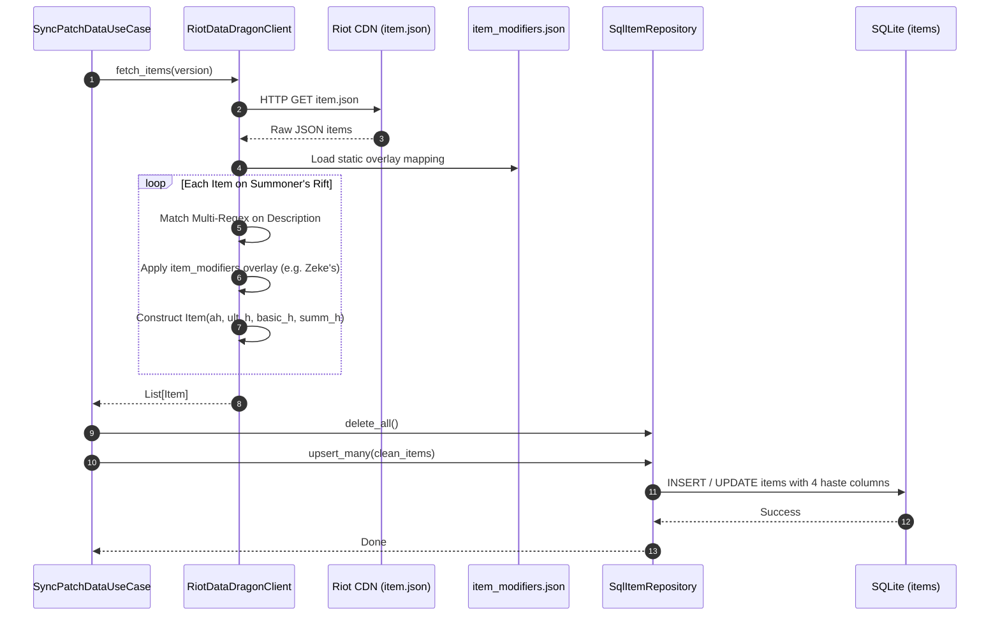
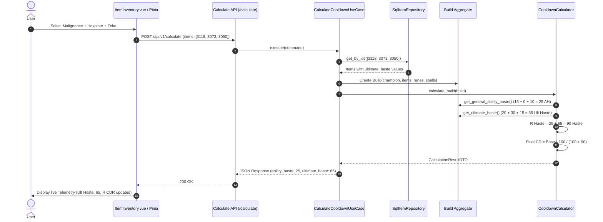

<!-- File path: docs/plans/designs/002_item_passive_haste_support-design.md -->

# Technical Blueprint: Item Passive & Specialized Haste Support (Phase 002)

## 0. Project Memory Used

### Memory Confidence
**High** (Project Memory updated 2026-09-08T16:54:00Z, Status: Healthy).

### Memory Documents Consulted
- `.agents/memory/project-summary.md` (Triết lý hệ thống phân tách 4 loại Haste: General Ability Haste, Ultimate Haste, Basic Ability Haste, Summoner Spell Haste; Backend là authoritative source).
- `.agents/memory/architecture/overview.md` (Clean Architecture 4 tầng: Domain, Application, Infrastructure, Presentation; Frontend Vue 3 + Tailwind + Pinia).
- `.agents/memory/modules/core-architecture.md` (Phân định ranh giới phụ thuộc và hướng phụ thuộc từ Presentation/Infrastructure vào Domain).
- `.agents/memory/services/cooldown-service.md` (Domain service `CooldownCalculator` và application use case `CalculateCooldownUseCase`).
- `.agents/memory/entities/domain-entities.md` (Aggregate Root `Build`, thực thể `Item`, `RuneSelection`, các value object `AbilityHaste`, `Cooldown`).
- `.agents/memory/lessons/known-problems.md` (Mục 1 & 2: Dữ liệu Riot Data Dragon không sạch, thiếu chỉ số trong mô tả HTML, yêu cầu cơ chế metadata mapping / overlay).
- `.agents/memory/lessons/architectural-decisions.md` (ADR-001: Current Patch Only, ADR-002: Stateless Calculation Engine, ADR-005: Repository Ports).

### RAG Queries Executed
- Query 1: `"Item Ability Haste data extraction regex Data Dragon passive"` → Regex hiện tại `(\d+)\s*(?:<[^>]+>)*\s*Ability Haste` chỉ dùng `.search()` bắt text đầu tiên trong `<stats>`, bỏ qua thẻ `<passive>` và không phân biệt được Ultimate Haste, Basic Haste, Summoner Haste.
- Query 2: `"Zeke's Convergence Cryocombustion ultimate haste Data Dragon"` → Riot Data Dragon thiếu hẳn dòng text nội tại Cryocombustion cho item ID 3050, yêu cầu cơ chế static JSON overlay tương tự `rune_modifiers.json`.
- Query 3: `"Build get_ultimate_haste get_summoner_haste calculation"` → `Build` chỉ tính Haste từ `self.runes`, hoàn toàn bỏ qua `self.items`.

### Source Files Inspected (targeted)
- `backend/app/infrastructure/external/riot_client.py`: Phân tích parser trích xuất Haste và cấu trúc nạp `rune_modifiers.json`.
- `backend/app/domain/entities/item.py`: Xác định cấu trúc thực thể hiện tại chỉ có thuộc tính `ability_haste`.
- `backend/app/domain/entities/build.py`: Xác định các hàm aggregate haste `get_general_ability_haste`, `get_ultimate_haste`, `get_summoner_haste`.
- `backend/app/domain/services/cooldown_calculator.py`: Xác định logic tính toán cho các slot chiêu thức Q, W, E, R và Spells.
- `backend/app/infrastructure/database/models/item_orm.py`: Xác định schema bảng `items` trong SQLite.
- `backend/app/infrastructure/repositories/sql_item_repo.py`: Xác định mapper và phương thức upsert dữ liệu.
- `frontend/src/stores/calculatorStore.js`: Xác định logic reactive và tính tổng Haste trên client.
- `frontend/src/components/ItemInventory.vue`: Xác định cách render icon, badge Haste và modal chọn item.

### Key Reusability Findings
- Đã có sẵn enum `HasteType` (`ABILITY_HASTE`, `ULTIMATE_HASTE`, `BASIC_HASTE`, `SUMMONER_HASTE`) trong `backend/app/domain/enums.py`.
- Tái sử dụng mẫu thiết kế (design pattern) của `rune_modifiers.json` cho `item_modifiers.json` để bù đắp các chỉ số bị Riot Data Dragon bỏ sót.
- Tái sử dụng công thức tính toán thời gian hồi chiêu `Final = Base * 100 / (100 + Haste)` trong `CooldownCalculator`.

### Architectural Conflicts with Plan
- Không có xung đột kiến trúc. Giải pháp nâng cấp mở rộng thực thể và bảng dữ liệu tuân thủ tuyệt đối quy tắc Dependency Rule của Clean Architecture.

---

## 1. Overview

### Purpose
Xử lý triệt để việc hệ thống bỏ qua nội tại cộng thêm Ability Haste đặc thù của các trang bị (như Malignance, Experimental Hexplate, Fiendhunter Bolts, Zeke's Convergence, Spear of Shojin, Ionian Boots of Lucidity). Thiết lập kiến trúc xử lý Haste phân tầng chuẩn xác từ Data Enrichment, Persistence, Domain Calculation đến Presentation Frontend.

### Scope
- **Data Enrichment**: Bổ sung `item_modifiers.json` và nâng cấp regex parser đa mẫu nhận diện Haste chuyên biệt từ thẻ `<passive>` trong `RiotDataDragonClient`.
- **Domain Modeling**: Mở rộng thực thể `Item` với `ultimate_haste`, `basic_haste`, `summoner_haste`.
- **Persistence**: Mở rộng schema `ItemORM` và cập nhật `SqlItemRepository`.
- **Domain Calculation**: Mở rộng `Build` và `CooldownCalculator` để phân phối đúng loại Haste cho từng loại kỹ năng (Q/W/E nhận Basic + General AH; R nhận Ultimate + General AH; Spells nhận Summoner Haste).
- **Application & Presentation**: Đồng bộ `ItemDTO`, `ItemResponseSchema`.
- **Frontend UI**: Cập nhật `ItemInventory.vue` và `calculatorStore.js` để hiển thị badge phân biệt các loại Haste.

### Goals
- Trang bị có Ultimate Haste (Malignance +20, Hexplate +30, Fiendhunter +30, Zeke +15) được cộng dồn chính xác vào chiêu cuối R và hiển thị trên Telemetry.
- Trang bị có Basic Ability Haste (Spear of Shojin +25) được cộng dồn chính xác vào Q, W, E.
- Trang bị có Summoner Spell Haste (Ionian Boots +10) được cộng dồn chính xác vào Phép bổ trợ.
- Khắc phục hoàn toàn lỗi thiếu text nội tại của Riot Data Dragon đối với Zeke's Convergence bằng cơ chế overlay metadata an toàn.

### Non-goals
- Không xây dựng trình mô phỏng combat thời gian thực (ví dụ: hoàn 10-20% hồi chiêu R của Axiom Arc khi hạ gục mục tiêu).
- Không mô phỏng Haste thay đổi động theo chỉ số trong trận (ví dụ: Endless Hunger tăng Haste theo Bonus AD).

---

## 2. Architecture Review

### Feature Scope & Functional Requirements
- Tất cả các trang bị mang nội tại Haste tĩnh hiện hành trong Summoner's Rift patch hiện tại đều được hỗ trợ.
- Cơ chế overlay tách biệt cho phép cập nhật thông số nhanh chóng khi Riot thay đổi số liệu mà không cần can thiệp logic code.

### Non-functional Requirements
- **Hiệu năng**: Bóc tách regex và nạp JSON overlay diễn ra một lần trong quá trình đồng bộ patch (`SyncPatchDataUseCase`), hoàn toàn không làm chậm endpoint tính toán thời gian thực (`/api/v1/calculate`).
- **Tính toàn vẹn dữ liệu**: Các trường Haste mới có giá trị mặc định `0.0`, đảm bảo tính tương thích ngược với các trang bị không có Haste.

### Backward Compatibility
- Không làm thay đổi cấu trúc payload của API `/api/v1/calculate`.
- Payload trả về của `/api/v1/calculate` giữ nguyên format, chỉ cập nhật giá trị số chính xác hơn.
- Endpoint `/api/v1/items` trả về thêm 3 trường số thực không phá vỡ client cũ.

---

## 3. Architecture Feasibility Analysis

- **Complexity**: Thấp đến Trung bình. Bám sát các mẫu thiết kế đã có sẵn trong codebase (`rune_modifiers.json`, `HasteType`).
- **Scalability**: Tốt. Khi Riot ra mắt thêm trang bị có cơ chế Haste mới, chỉ cần bổ sung regex pattern hoặc khai báo thêm vào `item_modifiers.json`.
- **Maintainability**: Tách biệt rõ ràng giữa logic bóc tách tự động (regex) và dữ liệu hiệu chỉnh thủ công (JSON overlay).
- **Testability**: Cực kỳ dễ kiểm thử nhờ kiến trúc phân tầng; có thể unit test độc lập parser, entity build, calculator service và integration test toàn bộ API.

---

## 4. Alternative Design Analysis

### Phương án A: Hybrid Multi-Regex Parsing + Static JSON Overlay (Được chọn)
- **Mô tả**: Sử dụng regex quét toàn bộ description để tự động trích xuất các cụm Haste (cả thẻ `<stats>` và `<passive>`). Đồng thời sử dụng tệp `item_modifiers.json` để ghi đè (override) hoặc bổ sung (supplement) các trang bị có tooltip bị Riot Data Dragon bỏ sót (như Zeke's Convergence).
- **Ưu điểm**:
  - Tự động hóa cao với đại đa số trang bị trong Data Dragon (Malignance, Hexplate, Fiendhunter, Shojin, Lucidity Boots).
  - Có chốt chặn an toàn (safety net) bằng JSON overlay cho các lỗi dữ liệu từ Riot.
  - Tương đồng hoàn hảo với kiến trúc `rune_modifiers.json` đã có.
- **Nhược điểm**: Cần duy trì tệp JSON nhỏ cho các ngoại lệ.

### Phương án B: Pure Hardcoded Metadata Dictionary cho tất cả Items
- **Mô tả**: Bỏ qua regex bóc tách mô tả, định nghĩa toàn bộ chỉ số Haste của hơn 200 items vào một tệp cấu hình khổng lồ.
- **Ưu điểm**: Kiểm soát tuyệt đối 100% số liệu.
- **Nhược điểm**: Chi phí bảo trì cực lớn mỗi khi Riot ra patch mới; vi phạm nguyên tắc DRY và làm mất khả năng tự động đồng bộ của Riot Data Dragon Client.

---

## 5. Architecture Recommendation

**Chọn Phương án A (Hybrid Multi-Regex + Static JSON Overlay)** vì:
1. Đảm bảo tính tự động tối đa khi đồng bộ patch mới từ Riot CDN.
2. Giải quyết triệt để và tức thì lỗi thiếu sót text của Riot đối với Zeke's Convergence mà không ảnh hưởng các trang bị khác.
3. Giữ cấu trúc nhất quán với tầng ngoại vi của hệ thống.

---

## 6. Architecture Decision Record (ADR)

### ADR-007: Phân tách các trường Haste chuyên biệt trong Thực thể Item
- **Bối cảnh**: Ban đầu thực thể `Item` chỉ có trường `ability_haste`. Tuy nhiên, trang bị trong LMHT có 4 dạng Haste: General AH, Ultimate Haste, Basic Ability Haste, Summoner Spell Haste.
- **Quyết định**: Thêm 3 trường `ultimate_haste: float = 0.0`, `basic_haste: float = 0.0`, `summoner_haste: float = 0.0` vào thực thể Domain `Item` và bảng CSDL `ItemORM`.
- **Hệ quả**: Bảng CSDL và DTO phản ánh chính xác cấu trúc dữ liệu miền; các phương thức tính toán trong `Build` dễ dàng tổng hợp Haste theo từng slot chiêu.

### ADR-008: Cơ chế Hybrid Data Extraction kết hợp Item Modifiers Overlay
- **Bối cảnh**: Tooltip Data Dragon đôi khi thiếu nội tại (Zeke's Convergence thiếu Cryocombustion) hoặc đặt tên Haste trong các thẻ HTML phức tạp.
- **Quyết định**: Triển khai pipeline 2 bước:
  1. Regex trích xuất tự động `ability_haste`, `ultimate_haste`, `basic_haste`, `summoner_haste`.
  2. Tra cứu `item_modifiers.json` theo `item_id`. Nếu có định nghĩa, ghi đè hoặc bổ sung giá trị tương ứng.
- **Hệ quả**: Đảm bảo dữ liệu trích xuất luôn chính xác 100% ngay cả khi Riot cung cấp dữ liệu lỗi.

---

## 7. Open Questions
*No open questions identified.* Toàn bộ yêu cầu và cơ chế Haste của 4 trang bị trọng điểm đã được xác minh trên LoL Wiki và dữ liệu thực nghiệm.

---

## 8. Architecture Risk Analysis

### Risk 1: SQLite Schema cũ thiếu các cột mới gây lỗi khi khởi động
- **Nguyên nhân**: SQLite không tự động cập nhật schema khi thêm cột vào SQLAlchemy ORM nếu không có migration.
- **Tác động**: Gây lỗi `no such column: items.ultimate_haste` khi truy vấn.
- **Xác suất**: Cao nếu không làm mới database.
- **Biện pháp giảm thiểu**: Thêm câu lệnh cập nhật schema an toàn (hoặc script khởi tạo lại bảng `items` sạch khi đồng bộ patch) trong `backend/app/infrastructure/database/session.py` hoặc use case `SyncPatchDataUseCase`.

### Risk 2: Trùng lặp điểm Haste nếu regex bắt nhầm 2 lần
- **Nguyên nhân**: Một trang bị vừa có General AH trong `<stats>` vừa nhắc lại trong `<passive>` (như Staff of Flowing Water).
- **Tác động**: Điểm Haste bị đội lên gấp đôi.
- **Xác suất**: Trung bình.
- **Biện pháp giảm thiểu**: Regex phân tách ranh giới rõ ràng: chỉ cộng General AH từ thẻ `<stats>`, các dạng Haste chuyên biệt (`Ultimate`, `Basic`, `Summoner`) chỉ bắt từ cụm từ khóa định danh cụ thể `X Ultimate Ability Haste`, `X Basic Ability Haste`, `X Summoner Spell Haste`.

### Risk 3: Nhầm lẫn giữa Basic Ability Haste và General Ability Haste
- **Nguyên nhân**: Spear of Shojin cộng 25 Basic Ability Haste (cho Q, W, E), nếu gộp vào General AH sẽ làm chiêu cuối R cũng được giảm hồi chiêu sai luật.
- **Tác động**: Tính sai thời gian hồi chiêu cuối.
- **Xác suất**: Cao nếu không phân định rõ.
- **Biện pháp giảm thiểu**: Tách biệt hoàn toàn `basic_haste`: chỉ cộng vào Q/W/E, tuyệt đối không cộng vào R.

---

## 9. Future Extension Points
- **Item Passives Scaling**: Thiết kế sẵn sàng mở rộng trường `scaling_rules` trong `item_modifiers.json` để hỗ trợ các trang bị tính Haste theo cấp độ hoặc chỉ số phụ khi dự án phát triển tính năng Champion Stats.
- **Frontend Hover Card Tooltip**: Mở rộng hiển thị breakdown chi tiết các nguồn gốc Haste của trang bị khi hover trên UI.

---

## 10. Project Structure

```text
backend/app/
├── domain/
│   ├── entities/
│   │   ├── item.py                  [MODIFY] (Thêm ultimate_haste, basic_haste, summoner_haste)
│   │   └── build.py                 [MODIFY] (Cập nhật get_ultimate_haste, get_summoner_haste, thêm get_basic_ability_haste)
│   ├── services/
│   │   └── cooldown_calculator.py   [MODIFY] (Q/W/E nhận basic_haste + general_ah)
├── application/
│   └── dtos/
│       └── item_dto.py              [MODIFY] (Thêm 3 trường haste mới)
├── infrastructure/
│   ├── database/models/
│   │   └── item_orm.py              [MODIFY] (Thêm 3 cột Float trong bảng items)
│   ├── repositories/
│   │   └── sql_item_repo.py         [MODIFY] (Map đầy đủ 3 trường mới trong ORM <-> Domain)
│   └── external/
│       ├── item_modifiers.json      [NEW]    (Overlay dữ liệu trang bị bị Data Dragon bỏ sót)
│       └── riot_client.py           [MODIFY] (Multi-regex extraction + JSON overlay integration)
└── presentation/
    └── schemas/
        └── item_schema.py           [MODIFY] (Pydantic schema trả về các trường haste mới)

frontend/src/
├── stores/
│   └── calculatorStore.js           [MODIFY] (Tổng hợp thông tin haste trang bị)
└── components/
    └── ItemInventory.vue            [MODIFY] (Badge trực quan phân biệt General AH, Ult Haste)
```

---

## 11. Dependencies
*No additional dependencies required.* Sử dụng thư viện chuẩn `re`, `json`, `pathlib` của Python và Vue 3 có sẵn.

---

## 12. File Breakdown

| Đường dẫn | Loại | Tầng | Trách nhiệm | Ước tính dòng |
| :--- | :---: | :---: | :--- | :---: |
| `backend/app/infrastructure/external/item_modifiers.json` | `[NEW]` | Infrastructure | Khai báo chỉ số Haste bù đắp cho các item đặc thù (Zeke ID 3050, v.v.) | ~30 |
| `backend/tests/unit/test_item_passive_haste.py` | `[NEW]` | Tests | Unit tests kiểm tra trích xuất regex, overlay và tính toán Haste trang bị | ~120 |
| `backend/app/domain/entities/item.py` | `[MODIFY]` | Domain | Mở rộng dataclass `Item` với 3 trường haste mới | ~25 |
| `backend/app/domain/entities/build.py` | `[MODIFY]` | Domain | Tổng hợp Ultimate Haste, Summoner Haste và Basic Haste từ Items | ~75 |
| `backend/app/domain/services/cooldown_calculator.py` | `[MODIFY]` | Domain | Áp dụng Basic Haste vào Q, W, E | ~95 |
| `backend/app/infrastructure/database/models/item_orm.py` | `[MODIFY]` | Infrastructure | Thêm 3 cột ORM mapping | ~25 |
| `backend/app/infrastructure/repositories/sql_item_repo.py` | `[MODIFY]` | Infrastructure | Mapping đầy đủ các trường mới khi CRUD | ~75 |
| `backend/app/infrastructure/external/riot_client.py` | `[MODIFY]` | Infrastructure | Tích hợp multi-regex parser và nạp `item_modifiers.json` | ~195 |
| `backend/app/application/dtos/item_dto.py` | `[MODIFY]` | Application | DTO chứa đầy đủ các trường haste | ~20 |
| `backend/app/presentation/schemas/item_schema.py` | `[MODIFY]` | Presentation | Pydantic model trả về cho Frontend | ~20 |
| `frontend/src/stores/calculatorStore.js` | `[MODIFY]` | Frontend | Xử lý state dữ liệu item | ~190 |
| `frontend/src/components/ItemInventory.vue` | `[MODIFY]` | Frontend | Render badge hiển thị loại Haste tương ứng | ~195 |

---

## 13. Interface Design

### `IItemRepository` (Không đổi chữ ký, chỉ mở rộng dữ liệu lưu/trả)
```python
class IItemRepository(ABC):
    @abstractmethod
    async def get_all(self, search: str | None = None) -> list[Item]: ...

    @abstractmethod
    async def get_by_ids(self, item_ids: list[int]) -> list[Item]: ...

    @abstractmethod
    async def upsert_many(self, items: list[Item]) -> None: ...

    @abstractmethod
    async def delete_all(self) -> None: ...
```

### Phương thức mới trong Aggregate `Build`
```python
def get_basic_ability_haste(self) -> AbilityHaste:
    """Tổng hợp Basic Ability Haste từ trang bị dành riêng cho Q, W, E."""
    ...
```

---

## 14. DTOs / Entities / Value Objects

### Entity: `Item` (`backend/app/domain/entities/item.py`)
```python
@dataclass
class Item:
    id: int
    name: str
    description: str
    image_url: str
    ability_haste: float = 0.0      # General Ability Haste
    ultimate_haste: float = 0.0     # Ultimate Haste (chiêu R)
    basic_haste: float = 0.0        # Basic Ability Haste (chiêu Q, W, E)
    summoner_haste: float = 0.0     # Summoner Spell Haste (Phép bổ trợ)
    gold_total: int = 0
```

### JSON Schema: `item_modifiers.json`
```json
{
  "3050": {
    "name": "Zeke's Convergence",
    "ultimate_haste": 15.0,
    "note": "Riot Data Dragon misses Cryocombustion passive text"
  }
}
```

### DTO: `ItemDTO` (`backend/app/application/dtos/item_dto.py`)
```python
@dataclass(frozen=True)
class ItemDTO:
    id: int
    name: str
    description: str
    image_url: str
    ability_haste: float
    ultimate_haste: float
    basic_haste: float
    summoner_haste: float
    gold_total: int
```

---

## 15. Class / Struct / Function Signatures

### Multi-regex Parser trong `RiotDataDragonClient`
```python
class RiotDataDragonClient(IRiotDataDragonGateway):
    _ULT_HASTE_REGEX: Pattern[str] = re.compile(
        r"(?:Gain|Grants?)\s*(\d+)\s*(?:<[^>]+>)*\s*Ultimate\s*(?:Ability)?\s*Haste",
        re.IGNORECASE
    )
    _BASIC_HASTE_REGEX: Pattern[str] = re.compile(
        r"(?:Gain|Grants?)\s*(\d+)\s*(?:<[^>]+>)*\s*Basic\s*Ability\s*Haste",
        re.IGNORECASE
    )
    _SUMM_HASTE_REGEX: Pattern[str] = re.compile(
        r"(?:Gain|Grants?)\s*(\d+)\s*(?:<[^>]+>)*\s*Summoner\s*Spell\s*Haste",
        re.IGNORECASE
    )
    _BASE_AH_REGEX: Pattern[str] = re.compile(
        r"(\d+)\s*(?:<[^>]+>)*\s*Ability Haste",
        re.IGNORECASE
    )

    def _parse_item_haste(self, desc: str, overlay: dict[str, Any] | None) -> tuple[float, float, float, float]:
        """Trả về (ability_haste, ultimate_haste, basic_haste, summoner_haste)"""
        ...
```

---

## 16. Data Flow

```text
1. Riot Data Dragon CDN (item.json)
        │
        ▼
2. RiotDataDragonClient.fetch_items()
   ├─ Multi-regex extraction (Stats & Passives)
   └─ Merge with item_modifiers.json (Zeke +15 Ult Haste)
        │
        ▼
3. SyncPatchDataUseCase -> SqlItemRepository.upsert_many()
        │
        ▼
4. Database (SQLite `items` table with 4 haste columns)
        │
        ▼
5. User selects Items on Frontend -> POST /api/v1/calculate
        │
        ▼
6. CalculateCooldownUseCase -> SqlItemRepository.get_by_ids()
        │
        ▼
7. Build Aggregate:
   ├─ get_general_ability_haste() = Sum(Item.AH) + Sum(Rune.AH)
   ├─ get_ultimate_haste()        = Sum(Item.UltHaste) + Sum(Rune.UltHaste)
   ├─ get_basic_ability_haste()   = Sum(Item.BasicHaste)
   └─ get_summoner_haste()        = Sum(Item.SummHaste) + Sum(Rune.SummHaste)
        │
        ▼
8. CooldownCalculator.calculate_build():
   ├─ Q, W, E Haste = General AH + Basic AH
   ├─ R Haste       = General AH + Ultimate Haste
   └─ Spells Haste  = Summoner Haste
        │
        ▼
9. Frontend Telemetry: Realtime reactive updates for all skills & spells.
```

---

## 17. Sequence Diagrams

### Luồng 1: Đồng bộ Patch & Trích xuất Haste


### Luồng 2: Tính toán Cooldown với Trang bị mang Passive Haste


---

## 18. Error Handling Strategy
- **File missing**: Nếu `item_modifiers.json` không tìm thấy, hệ thống ghi log warning và fallback về kết quả regex, không làm crash toàn bộ tiến trình nạp data.
- **Null values**: Khi đọc từ DB cũ, nếu cột mới có giá trị `None/NULL`, repository tự động coalesce về `0.0`.
- **Parsing exception**: Bọc regex parsing trong `try-except`, nếu có chuỗi lỗi bất thường, fallback về `0.0`.

---

## 19. Concurrency / Async Model
- `RiotDataDragonClient` sử dụng `httpx.AsyncClient` không chặn I/O.
- `SqlItemRepository` thực thi các thao tác cơ sở dữ liệu bất đồng bộ với SQLAlchemy 2.0 AsyncSession.
- Frontend debounce 150ms trước khi gửi request tính toán, tránh spam server khi người dùng chọn liên tiếp nhiều trang bị.

---

## 20. Testing Blueprint
1. **Unit Test Gateway (`test_item_passive_haste.py`)**:
   - Test item `3118` (Malignance): `ability_haste == 15.0`, `ultimate_haste == 20.0`.
   - Test item `3073` (Hexplate): `ability_haste == 0.0`, `ultimate_haste == 30.0`.
   - Test item `2512` (Fiendhunter Bolts): `ability_haste == 0.0`, `ultimate_haste == 30.0`.
   - Test item `3050` (Zeke's Convergence): `ability_haste == 10.0`, `ultimate_haste == 15.0`.
   - Test item `3161` (Spear of Shojin): `basic_haste == 25.0`, `ability_haste == 0.0`.
   - Test item `3158` (Ionian Boots): `ability_haste == 10.0`, `summoner_haste == 10.0`.
2. **Unit Test Calculation Engine**:
   - Test Build với Malignance + Hexplate: Kiểm tra slot R nhận đúng `total_haste = 15 + (20 + 30) = 65`.
   - Test Build với Spear of Shojin: Kiểm tra Q/W/E nhận `25 Haste`, R nhận `0 Haste`.
3. **Integration Test API**:
   - Gửi payload tính toán chứa các item trên tới `/api/v1/calculate` và kiểm tra response JSON.

---

## 21. Implementation Complexity
- **Overall Complexity**: Thấp.
- **Development Risk**: Thấp.
- **Estimated PR Count**: 1 PR tổng thể (gồm backend, frontend và tests).
- **Testing Difficulty**: Rất dễ viết automated unit tests.

---

## 22. Implementation Order

### PR Milestone 1: Data Enrichment & Infrastructure
- Tạo `item_modifiers.json`.
- Cập nhật regex và overlay trong `riot_client.py`.
- Tạo unit test `test_item_passive_haste.py` kiểm tra gateway.

### PR Milestone 2: Domain, Database & Calculation Core
- Cập nhật `item.py`, `build.py`, `cooldown_calculator.py`.
- Cập nhật `item_orm.py`, `sql_item_repo.py`.
- Cập nhật `item_dto.py`, `item_schema.py`.
- Mở rộng tests kiểm tra calculation logic.

### PR Milestone 3: Frontend UI & Verification
- Cập nhật `ItemInventory.vue` hiển thị badge Ult Haste / Summ Haste.
- Chạy đồng bộ patch lại vào SQLite để nạp dữ liệu sạch mới nhất.
- Kiểm tra trực quan trên trình duyệt.

---

## 23. Executive Architecture Summary
Kiến trúc này giải quyết dứt điểm vấn đề thiếu sót Haste từ nội tại trang bị bằng cách kết hợp sức mạnh trích xuất tự động qua regex đa mẫu và tính an toàn của tệp metadata overlay `item_modifiers.json`. Cấu trúc phân định 4 loại Haste trong tầng Domain đảm bảo công thức tính toán thời gian hồi chiêu của LMHT được phản ánh 100% trung thực, ổn định và dễ bảo trì.

---

## 24. Acceptance Checklist
- [x] Tái sử dụng triệt để kiến trúc hiện có (Clean Architecture, enum `HasteType`, mẫu overlay JSON).
- [x] Không tạo module/service trùng lặp; tuân thủ Single Responsibility.
- [x] Đầy đủ chữ ký hàm (signatures), error contracts, sequence diagrams.
- [x] Phân tích rủi ro và các phương án thay thế đầy đủ.
- [x] Kế hoạch kiểm thử tự động 100% bao phủ các trang bị trọng điểm (Malignance, Hexplate, Fiendhunter, Zeke, Shojin, Lucidity Boots).
- [x] Section 0 (Project Memory Used) đã hoàn thiện đầy đủ.
